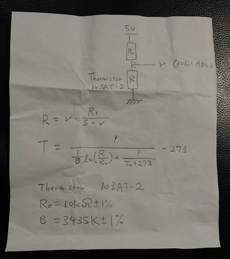

# Motion detector

This is a project to demonstrate motion detectors for sensing a person moving around in a room.

## Sensors

I often go shopping at [Akizuki-Denshi](http://akizukidenshi.com/) in Akihabara, Tokyo. The company sells sensors at low prices. Thanks a lot to Akizuki-Denshi! The company has been saveing my life!

- [Doppler sensor: NJR4265 J1](http://akizukidenshi.com/catalog/g/gK-07776/)
- [Force sensing registor: FSR406](http://akizukidenshi.com/catalog/g/gP-04158/)
- [Hall sensor: A1324LUA-T](http://akizukidenshi.com/catalog/g/gI-07014/)
- [GPS tracker (GPS module enclosed in my original 3D-printed case)](https://github.com/araobp/gps_android)
- [Thermistor](http://akizukidenshi.com/catalog/g/gP-07258/)
- [CdS](http://akizukidenshi.com/catalog/g/gI-00110/)

## Architecture

Physical
```
 [Sensor]--AnalogIn--[PIC16F1825]--UART--[FTDI]--USB--[RasPi]--WiFi--[Tablet or PC]
 
 [Sensor module]--UART--[FTDI]--USB--[RasPi]--WiFi--[Tablet or PC]
```

Logical
```
Raw data <--->[serial-mqtt bridge]<--MQTT-->[mosquitto]<--MQTT over WebSocket-->[SPA/AngularJS/HTML5/Chrome]
```

## "serialport" package

I have been owing this "serialport" package a lot for IoT prototyping since 2016: https://www.npmjs.com/package/serialport

Thanks a lot to the developers of the package.

I must admit that JavaScript/Node.js is the best language for rapid IoT prototyping, since I have been using it for IoT prototyping at work since 2016.

## MQTT over WebSocket

MQTT is MUST for IoT prototyping. I have even been using MQTT on HTML5.
- [Obtaining mosquitto with WebSockets enabled](https://xperimentia.com/2015/08/20/installing-mosquitto-mqtt-broker-on-raspberry-pi-with-websockets/)
- [Building browserMqtt.js](https://github.com/mqttjs/MQTT.js/)

## Making full screen for Android

I often use Android tablets for demonstrating an IoT prototype. Here is a tip to makeing a HTML5 page fulsucreen on Android: https://developer.chrome.com/multidevice/android/installtohomescreen

## AngularJS

I know about TypeScript and Angular2, but I stick to [AngularJS](https://angularjs.org/). I choose AngularJS over Angular2 for IoT prototyping for a lot of reasons.

## 10bit ADC (Analog-Digital Converter)

I have developed [10bit ADC (4 analog-in ports) on PIC16F1825](./src/pic16f1825/adc.X).


Pin numbers:
```
[AN6|AN5|AN4|AN2]
 P4  P3  P2  P1
```

CLI:
```
t:125\n  --> set the interval to 8msec * 125 = 1sec 

f:3\n  --> activate anaglon-in ports (b0011: P2 and P1)
```

I use this ADC with very cheap thermistor and CdS.

## Thermistor

I bought cheap thermistors ["103AT-2"](http://akizukidenshi.com/catalog/g/gP-07258/) (50 yen for each) in AKihabara.



